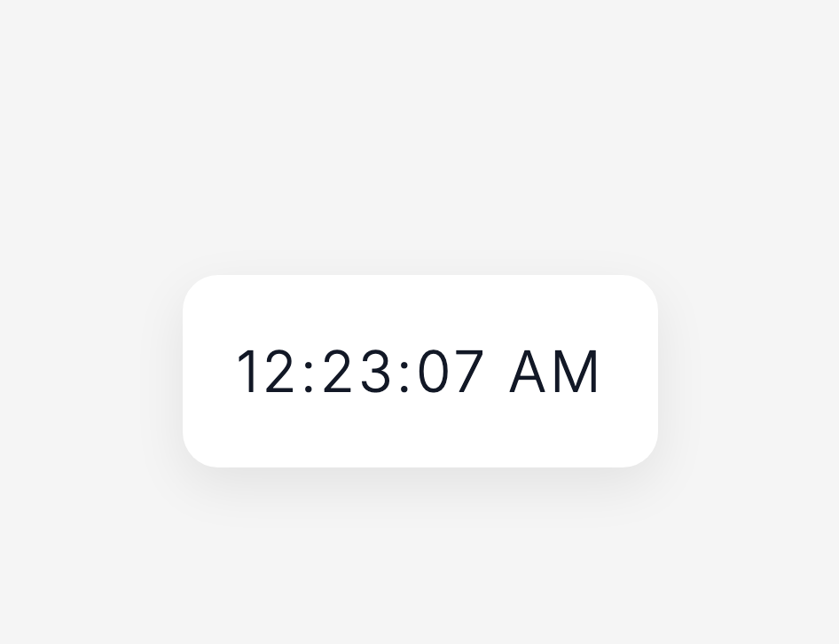

## 📸 Preview




# Minimalist React Digital Clock

A modern, responsive, and minimalist **Digital Clock** built using **React.js**. This project demonstrates how React Hooks (`useState` and `useEffect`) can be used to build a real-time application that updates automatically every second without manually manipulating the DOM.

The application follows modern React development practices by using **functional components**, **state-driven rendering**, and **lifecycle management** while maintaining a clean and minimal user interface inspired by modern dashboard and productivity applications.

---

# Table of Contents

- Project Overview
- Features
- Technologies Used
- Project Structure
- Application Workflow
- React Concepts Demonstrated
- Code Explanation
- CSS Design Philosophy
- Installation
- Running the Project
- Future Improvements
- Learning Outcomes
- Conclusion

---

# Project Overview

The Digital Clock is a lightweight React application that continuously displays the current system time.

Unlike traditional JavaScript implementations where developers manually modify the HTML using DOM methods every second, React follows a **declarative approach**. Whenever the application's state changes, React automatically updates only the parts of the user interface that need to change.

The clock retrieves the current time from the JavaScript `Date` object every second, stores it inside React state, formats it into a human-readable 12-hour clock, and renders it on the screen.

Although the project is simple, it introduces several important React concepts that are fundamental for developing larger applications.

---

# Features

- Real-time digital clock
- Updates every second automatically
- 12-hour clock format
- AM / PM notation
- Automatic leading zeros
- Responsive layout
- Minimalist user interface
- Modern typography
- React Hooks
- Clean component architecture

---

# Technologies Used

| Technology | Purpose |
|------------|----------|
| React.js | Building the user interface |
| JavaScript (ES6+) | Application logic |
| HTML5 | Component structure |
| CSS3 | Styling and layout |
| React Hooks | State and lifecycle management |

---

# Project Structure

```
src/
│
├── App.jsx
├── DigitalClock.jsx
├── index.css
│
└── assets/
```

---

# Application Workflow

The application follows the execution flow below.

```
Application Starts

        │

        ▼

App Component Loads

        │

        ▼

DigitalClock Component Mounts

        │

        ▼

Current Time Stored in State

        │

        ▼

useEffect Creates Timer

        │

        ▼

Every Second

        │

        ▼

New Date Object Created

        │

        ▼

React State Updates

        │

        ▼

Component Re-renders

        │

        ▼

Updated Time Displayed
```

---

# React Concepts Demonstrated

## Functional Components

The project is entirely built using **React Functional Components**.

```jsx
function DigitalClock() {

}
```

Functional components are plain JavaScript functions that return JSX.

They are preferred over class components in modern React because they are:

- Simpler
- Easier to read
- Easier to maintain
- Compatible with React Hooks

---

## React State

The application stores the current time using React's `useState` Hook.

```jsx
const [time, setTime] = useState(new Date());
```

### Why use state?

Whenever the state changes,

React automatically updates the user interface.

Without state, the displayed time would never change even though the actual system time continues to update.

---

## useEffect Hook

The timer is created inside

```jsx
useEffect()
```

```jsx
useEffect(() => {

}, []);
```

The empty dependency array

```jsx
[]
```

tells React:

> Execute this effect only once after the component has mounted.

Inside this effect,

```jsx
setInterval()
```

creates a timer that updates the clock every second.

---

## Timer Creation

```jsx
const intervalId = setInterval(() => {
    setTime(new Date());
},1000);
```

Every

```
1000 milliseconds
```

the application

1. Creates a new `Date` object.

2. Updates React state.

3. React detects the state change.

4. React re-renders the component.

5. The displayed time changes automatically.

---

## Cleanup Function

```jsx
return () => clearInterval(intervalId);
```

React executes this cleanup function whenever the component is removed.

This prevents

- Memory leaks
- Multiple intervals running simultaneously
- Unnecessary CPU usage

Cleaning up intervals is considered a React best practice.

---

# 🕒 Time Formatting

JavaScript returns time using the 24-hour format.

For example

```
15:08:04
```

The project converts it into

```
03:08:04 PM
```

using

```jsx
hours % 12 || 12
```

### Why?

Examples

| 24-Hour | 12-Hour |
|----------|----------|
| 00 | 12 AM |
| 01 | 1 AM |
| 12 | 12 PM |
| 15 | 3 PM |
| 23 | 11 PM |

This provides a user-friendly display.

---

# Leading Zeros

The helper function

```jsx
padZero()
```

ensures that every number has two digits.

Without it

```
8:4:5
```

With it

```
08:04:05
```

This improves readability and follows the appearance of traditional digital clocks.

---

# CSS Design Philosophy

The application follows a **minimalist design philosophy**.

Instead of using complex gradients, animations, or decorative elements, the interface focuses on

- whitespace
- typography
- subtle shadows
- clean spacing
- visual hierarchy

The design aims to provide a distraction-free experience while maintaining a modern appearance.

Key design features include

- Centered layout using Flexbox
- Responsive sizing
- Soft shadows
- Rounded corners
- Clean typography
- Mobile responsiveness

---

# Responsive Design

The interface automatically adjusts to different screen sizes using CSS media queries.

Desktop

```
Large typography

Generous spacing
```

Mobile

```
Smaller typography

Reduced padding

Better readability
```

---

# 🔄 Rendering Cycle

```
Current Time

↓

Stored Inside React State

↓

Formatted

↓

Rendered

↓

One Second Passes

↓

State Updates

↓

React Re-renders

↓

Updated Time Appears
```

---

# Installation

Clone the repository

```bash
git clone https://github.com/yourusername/react-digital-clock.git
```

Navigate into the project

```bash
cd react-digital-clock
```

Install dependencies

```bash
npm install
```

Run the development server

```bash
npm run dev
```

or

```bash
npm start
```

depending on your project configuration.

---

# Learning Outcomes

This project demonstrates practical understanding of

- React Functional Components
- JSX
- React Hooks
- useState
- useEffect
- State Management
- Component Lifecycle
- JavaScript Date Object
- Time Formatting
- Event Scheduling
- Responsive Design
- CSS Flexbox
- Modern UI Design
- Component-Based Architecture

---

# Future Improvements

Possible enhancements include

- Dark Mode
- Multiple Time Zones
- Display Current Date
- Stopwatch
- Countdown Timer
- Alarm Functionality
- Animated Digit Transitions
- Theme Switcher
- 24-Hour Mode Toggle
- Weather Integration

---

#  Key Concepts Reinforced

Throughout this project, the following React principles are demonstrated:

- **Declarative UI** — The interface automatically updates whenever the state changes.
- **State Management** — The current time is managed using `useState`.
- **Lifecycle Management** — `useEffect` creates and cleans up the timer.
- **Component Reusability** — The clock is encapsulated within a reusable functional component.
- **Responsive Design** — CSS ensures the interface adapts to different screen sizes.
- **Separation of Concerns** — Logic, presentation, and styling are organized into separate files.

---

# Conclusion

Although this project is relatively small, it demonstrates several core concepts that are fundamental to modern React development. By combining **React Functional Components**, **Hooks**, **state-driven rendering**, and **responsive CSS**, the application efficiently displays a continuously updating digital clock while maintaining clean, maintainable, and reusable code.

The project serves as an excellent introduction to React's component model and showcases how even simple applications can benefit from React's declarative programming paradigm. It also provides a strong foundation for more advanced projects involving asynchronous updates, APIs, routing, and complex state management.

---

Developed as a learning project to strengthen practical understanding of:

- React.js
- React Hooks
- JavaScript ES6+
- Responsive Web Design
- Component-Based Architecture
- Modern Frontend Development

If you found this project useful, consider ⭐ starring the repository.
